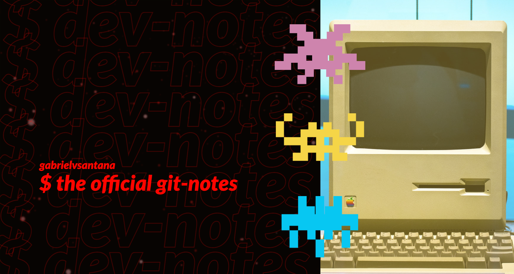

# $ git-notes



The idea of this file is to share the commands and workflow I use in my daily life as a software engineer.

<br/>

# Table of Contents

1. [General Commands I Use](#general-commands-i-use)
1. [Branching Strategy](#branching-strategy)
1. [Commit Strategy](#commit-strategy)
	1. [Commit Types](#commit-types)
	1. [Commit Message](#commit-message)
	1. [Examples](#examples)
1. [PR Strategy](#pr-strategy)
	1. [Title](#title)
		1. [Examples](#examples-1)
	1. [Body](#body)
1. [Hot Fix Strategy](#hot-fix-strategy)
1. [Git Config](#git-config)
	1. [Set default editor to Visual Studio Code](#set-default-editor-to-visual-studio-code)
	1. [To edit](#to-edit)
1. [For More Dev Notes](#for-more-dev-notes)

<br/>

# General Commands I Use

`$ git fetch` - Fetch all branches of a given repository

`git pull` - Fetch the latest changes of the current branch on the remote server

`git pull --rebase` - Fetch the latest changes and rebase

`git add .` - Stage all files that have been changed

`git commit -m "commit message"` - Make a commit with a given message

`git commit --amend` - Add changes to the last commit

`git commit --amend --no-edit` - Add changes to the last commit without editing the title or the commit message

`git branch -M  <branch_name>` - Move changes from one branch to another

`git checkout <branch_name>` - Switch to another branch

`git checkout -b <branch_name>` - Creates a branch

`git branch -D <branch_name>` - Deletes a branch

`git cherry-pick <commit_hash>` - Pick changes from another branch's commit to the current one

`git status` - Displays the current status of the branch

`git log` - Check the list of commits

`git stash` - Saves current changes that haven't been committed so that you can switch branches, or do anything else really

`git stash apply` - Apply the latest stashed changes to the current branch

`git stash apply {1}` - Apply specific stashed change to the current branch

`git reset --soft <commit_hash>` - Restore the branch to the state as it was before the given commit hash. Instead of deleting those changes, it leaves everything in the stage area

`git rebase <branch_name_to_rebase>` - Rebases `branch_name` into current branch

`git merge <branch_name_to_merge>` - Merges `branch_name` into current branch

`git merge --abort` - If you are fixing conflicts, it aborts the merge and returns the branch to the previous state

`git push --set-upstream origin <branch_name>` - Push changes to a new branch on the remote server

`git push` - Push local changes to the remote server

`git push -f origin <branch_name>` - Force push when there are conflicts

`git log --oneline --all --decorate --graph` - Displays the commit history of all branches with a graph

`git log --oneline --decorate --graph` - Displays the commit history of the current branch with a graph

<br/>

# Branching Strategy

TODO:
- Trunk-Based Development
- Forking Strategy
- GitFlow

<br/>

# Commit Strategy

Having a consistent commit strategy is a must when working with a team. A well-defined strategy can bring order to the commit history, making it easier to understand in the long run. It also helps improve code quality, makes collaboration smoother, and allows for easy rollback and problem resolution. So, don't forget the importance of a good commit strategy!

There are many articles and conventions about the topic, but I like to follow the pattern bellow. Please note that is heavily inspired by [Conventional Commits](https://www.conventionalcommits.org/)

```
<type>[<project-acronym>-<ticket-number>]: <short-description>


[body] // Optional text with changes in bullet points/enumarations
```

## Commit Types

1. `feat` - Introducing a new feature

1. `fix` - Fixing a bug

1. `test` - Improving or adding tests

1. `refactor` - Making code changes without affecting functionality

1. `build` - Changes to build system or dependencies (e.g. gulp, npm)

1. `ci` - Changes to CI setup (e.g. Travis, GitLabCI, CircleCI)

1. `docs` - Changes to documentation only

1. `perf` - Improving code performance

1. `style` - Formatting, styling, or punctuation changes without affecting code meaning

## Commit Message

You should:
- Use all lowercase letters
- Use the present indefinite tense
- Keep it short and descriptive as much as possible

## Examples

```
[FOX-132] feat: add typeorm migrations
```
```
[FOX-293] feat: add email confirmation to sign up page
```
```
[FOX-352] fix: fix bug in reporting module
```
```
[FOX-419] perf: improve performance of image processing algorithm
```

<br/>

# PR Strategy

## Title

The same as the commit, but with uppercase letters allowed in the message.

### Examples

```
[FOX-132] feat: Add TypeORM migrations
```
```
[FOX-293] feat: Add email confirmation to sign up page
```
```
[FOX-352] fix: Fix bug in reporting module
```
```
[FOX-419] perf: Improve performance of image processing algorithm
```

## Body

It's optional, but it can be beneficial to include information about design and architectural choices in your commits. This can help provide context and explain the reasoning behind your implementation, rather than just documenting the changes themselves.

<br/>

# Hot Fix Strategy

The idea of this strategy is to have two merge requests, one for the production environment and one for the development environment, with the same commit hash. This can be achieved through the following steps:

1. Create a branch from the main branch
1. Submit PRs for both the development and the main branches
1. Merge the PR into the development environment
1. Wait for confirmation from QA that the changes have resolved the issue
1. Merge the PR into the main branch
1. Delete the branch

The merge command provides Git with a clearer picture of the changes being made, allowing for a smoother merging process. In contrast, when cherry-picking, Git has a more limited view of the changes, potentially causing conflicts that must be manually resolved.

<br/>

# Git Config

`git config --system` - Config for everyone on the machine

`git config --global` - Config for the users on every project

`git config --local` - Config only for the project

`git config --list` - List git configuration

## Set default editor to Visual Studio Code

git config --global core.editor code

##  To edit

git config --global --edit

```
# This is Git's per-user configuration file.
[user]
	email = your@email.com
	name = Your Name
[core]
	editor = code --wait
[alias]
	s = !git status -s
	c = !git add --all && git commit -m
	l = !git log --pretty=format:'%C(blue)%h%C(red)%d %C(white)%s - %C(cyan)%cn, %C(green)%cr'
  ```

`--pretty=format:''` - We use to customise log format, exactly like --oneline

`%C()` - Choose color

`H` - Long hash

`h` - Reduced hash

`d` - Branch and if there's a tag, show it too

`s` - Subject

`cn` - Comitter name

`cr` - Comitter date

`git s` - alias for `git status -s`

`git c` - alias for `git add --all && git commit -m`

`git l` - alias for `git log --pretty=format:'%C(blue)%h%C(red)%d %C(white)%s - %C(cyan)%cn, %C(green)%cr'`

<br/>

# For More Dev Notes

This is just one piece of my open personal notes collection, where I'm mapping out all my knowledge. If you're keen on checking out other topics, give this a click: ***[official dev-notes](https://github.com/gabrielvsantana/dev-notes)***